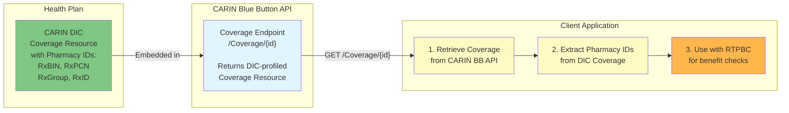

# RTPBC Reference Implementation Demo

A demonstration of how to bridge CARIN Digital Insurance Card (DIC) Coverage resources with Real-Time Pharmacy Benefit Check (RTPBC) requirements, enabling real-world adoption of pharmacy benefit checking at the point of prescribing.

## 🔗 Coverage Resource Relationships



This implementation demonstrates how CARIN DIC Coverage Resources are embedded within CARIN Blue Button APIs, then retrieved and used to enable Real-Time Pharmacy Benefit Check workflows, helping **patients** get real-time benefits information about their prescriptions.

## 🎯 The Interoperability Challenge

This reference implementation addresses a critical gap preventing widespread adoption of real-time pharmacy benefit checking in the United States healthcare system.

## 📋 Problem Statement

### The Vision: Real-Time Pharmacy Benefit Check

The [CARIN Real-Time Pharmacy Benefit Check (RTPBC) Implementation Guide](https://hl7.org/fhir/us/carin-rtpbc/) enables a transformative capability: allowing prescribers to check medication coverage and patient out-of-pocket costs at the point of prescribing. This means:

- Patients know their copay before leaving the doctor's office
- Physicians can discuss affordable alternatives during the visit
- Prior authorization requirements are identified immediately
- Pharmacy surprises and medication abandonment are reduced

### The Barrier: Missing Pharmacy Identifiers

RTPBC requires specific pharmacy benefit identifiers to route requests to the correct Pharmacy Benefit Manager (PBM) systems. These identifiers, familiar from physical insurance cards, include:

- **`rxid`** - The member's unique identifier for pharmacy benefits (often different from medical ID)
- **`rxgroup`** - Identifies the specific benefit design/formulary 
- **`rxbin`** - Bank Identification Number that routes to the correct PBM processor
- **`rxpcn`** - Processor Control Number for additional routing specificity

Without these identifiers, RTPBC requests cannot be processed - they literally cannot reach the systems that know the patient's drug coverage.

### The Gap: CARIN Blue Button Doesn't Include Pharmacy Elements

Most health plans have implemented the [CARIN Consumer Directed Payer Data Exchange (CARIN Blue Button®) Implementation Guide](http://hl7.org/fhir/us/carin-bb/), which enables patients to access their claims data via FHIR APIs. However, the Coverage resource in CARIN BB was designed for medical claims and doesn't profile these pharmacy-specific elements.

This creates a chicken-and-egg problem:
- Prescriber systems need these identifiers to check drug prices
- Payer systems have the data but don't expose it via their FHIR APIs
- Adding new fields to existing implementations is a significant undertaking

### The Bridge: CARIN Digital Insurance Card

The [CARIN Digital Insurance Card Implementation Guide](https://hl7.org/fhir/us/insurance-card/) was designed to digitize insurance cards for mobile wallets and apps. Critically, it includes ALL the pharmacy identifiers needed for RTPBC:

```
Coverage.class[rxbin]   → Maps to → RTPBC Coverage.class:bin
Coverage.class[rxpcn]   → Maps to → RTPBC Coverage.class:pcn  
Coverage.class[rxgroup] → Maps to → RTPBC Coverage.class:rxgroup-id
Coverage.class[rxid]    → Maps to → RTPBC Coverage.class:pbm-member-id
```

Many payers are already implementing or planning to implement digital insurance cards for member convenience. This creates an opportunity: **systems that expose CARIN DIC Coverage resources already have the data needed for RTPBC**.

### Why This Matters

- **For Patients**: Medication costs become transparent at the point of care, reducing abandonment and improving adherence
- **For Providers**: Enables informed prescribing decisions during the visit by helping patients get real-time benefit information
- **For Payers**: Existing digital insurance card implementations can enable RTPBC without major rework
- **For the Ecosystem**: Demonstrates how FHIR IGs can work together to solve real-world problems

## 💡 Solution

This demo implements a complete end-to-end flow:

1. **SMART on FHIR Authorization** - Simulated OAuth2 flow with popup-based authentication
2. **FHIR API Integration** - Retrieves Coverage resources with the CARIN DIC profile
3. **Data Transformation** - Maps DIC Coverage elements to RTPBC-required format
4. **Visual Demonstration** - Side-by-side comparison showing the transformation

## 🚀 Quick Start

### Prerequisites
- [Bun](https://bun.sh) runtime installed
- Modern web browser (Chrome, Firefox, Safari, or Edge)
- Port 3000 and 3001 available

### Installation & Running

1. **Clone the repository**
   ```bash
   git clone <repository-url>
   cd rtpbc-demo
   ```

2. **Start the Mock FHIR Server**
   ```bash
   cd server
   bun install
   bun run dev
   ```
   The server will start on http://localhost:3001

3. **Start the Client Application** (in a new terminal)
   ```bash
   cd client
   bun serve.js
   ```
   The client will be available at http://localhost:3000

## 📖 Demo Walkthrough

1. **Navigate to http://localhost:3000** in your browser
2. **Click "Start SMART Launch"** to begin the authorization flow
3. **Sign in** using the pre-filled demo credentials (or any values)
4. **View the transformation** as the app:
   - Fetches the CARIN DIC Coverage resource
   - Transforms it to RTPBC format
   - Displays both versions side-by-side
   - Shows the field mappings

## 🏗️ Architecture

### Project Structure
```
rtpbc-demo/
├── server/                 # Mock FHIR server
│   ├── index.js           # Express server with SMART auth
│   ├── mockData.js        # FHIR resource examples
│   └── auth.html          # OAuth authorization page
├── client/                 # Browser-based demo app
│   ├── index.html         # Main application UI
│   ├── app.js             # SMART client & transformation logic
│   └── styles.css         # Application styling
└── README.md              # This file
```

### Key Components

- **Mock FHIR Server**: Implements SMART on FHIR authorization and FHIR API endpoints
- **Coverage Transformation**: Maps CARIN DIC fields to RTPBC requirements
- **Visual Interface**: Shows the complete data flow and transformations

## 🔄 Field Mapping Details

The transformation preserves critical pharmacy routing information:

| CARIN DIC Field | Example Value | RTPBC Field | Purpose |
|-----------------|---------------|-------------|---------|
| Coverage.class[rxbin] | "100045" | Coverage.class:bin | PBM routing |
| Coverage.class[rxpcn] | "1234000" | Coverage.class:pcn | Processor routing |
| Coverage.class[rxgroup] | "GOLD2024" | Coverage.class:rxgroup-id | Group benefits |
| Coverage.class[rxid] | "102345672-01" | Coverage.class:pbm-member-id | Member identification |

## 🔒 Security Considerations

This is a demonstration application with simplified security:
- Mock authentication (no real credentials required)
- No data persistence
- CORS enabled for local development

**For production implementations**:
- Implement real SMART on FHIR security
- Follow OAuth2 best practices
- Validate all FHIR resources
- Implement proper error handling
- Add audit logging

## 🛠️ Implementation Standards

This reference implementation follows these HL7 FHIR Implementation Guides:

- **[CARIN Digital Insurance Card IG](https://hl7.org/fhir/us/insurance-card/)** - Source of pharmacy benefit identifiers
- **[CARIN RTPBC IG](https://hl7.org/fhir/us/carin-rtpbc/)** - Target format for pharmacy benefit checking
- **[SMART App Launch](https://hl7.org/fhir/smart-app-launch/)** - Authorization framework
- **[US Core](http://hl7.org/fhir/us/core/)** - Base FHIR profiles for US Realm

## 📚 Additional Resources

### CARIN Alliance Resources
- [CARIN Alliance](https://www.carinalliance.com/) - Advancing consumer-directed exchange
- [RTPBC Project Page](https://www.carinalliance.com/our-work/real-time-pharmacy-benefit-check/) - Overview and use cases
- [Digital Insurance Card Project](https://www.carinalliance.com/our-work/digital-insurance-card/) - Background and adoption

### Related Standards
- [NCPDP RTPBC Standard](https://www.ncpdp.org/) - Underlying pharmacy industry standard
- [Da Vinci Payer Data Exchange](http://hl7.org/fhir/us/davinci-pdex/) - Complementary payer-to-payer exchange
- [CMS Interoperability Rules](https://www.cms.gov/Regulations-and-Guidance/Guidance/Interoperability/index) - Regulatory context

## 🤝 Contributing

This is a reference implementation intended to demonstrate the concept. For questions or suggestions:
- Open an issue in the repository
- Contact the CARIN Alliance working groups
- Participate in HL7 FHIR connectathons

---

> **ℹ️ Sponsored by [Flexpa](https://www.flexpa.com)**  
> *Flexpa is committed to advancing healthcare interoperability and supporting real-world adoption of FHIR standards. We believe that patients deserve transparency in healthcare costs, and this reference implementation demonstrates one path toward that goal.*